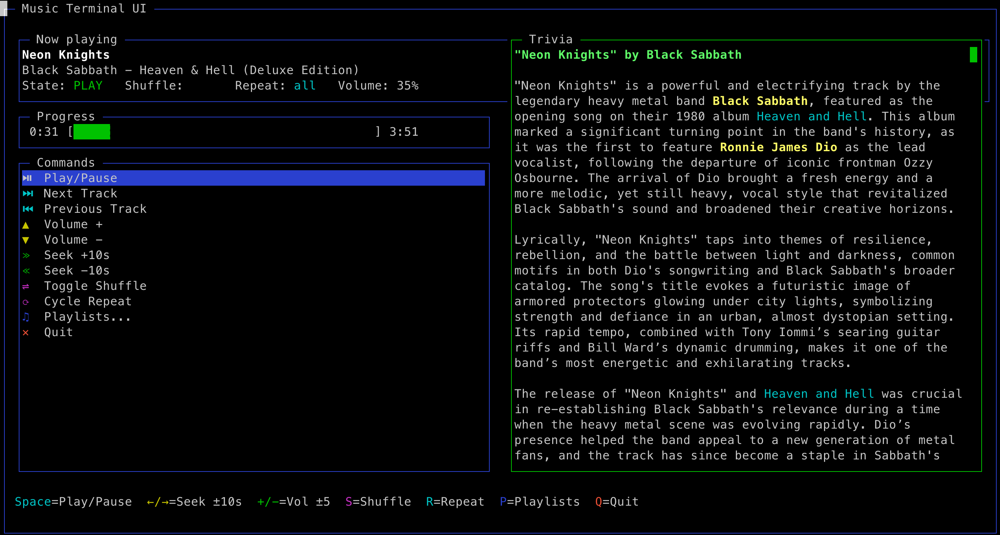
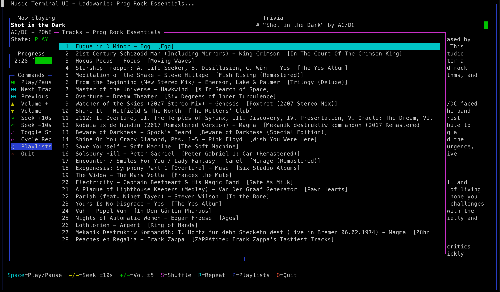

# Music Terminal UI for macOS

> Terminal-based UI for controlling the native Music app on macOS.




## Overview

This project provides a simple and responsive terminal-based user interface (TUI) to control the built-in **Music** app on macOS. It allows you to:

- Play / Pause
- Skip tracks
- Adjust volume
- Seek within songs
- Toggle shuffle and repeat
- Browse and play playlists

Ideal for keyboard-centric users, TUI fans, or remote control via SSH.

## Features

- 🎵  Real-time track info display
- ⌨️  Full keyboard navigation
- 🔊  Volume & seek controls
- 🔁  Shuffle & repeat toggles
- 📂  Playlist browsing
- 🤖  Optional AI-powered song trivia panel
- 🧼  Minimal resource usage

## Requirements

- macOS (tested on Ventura and later)
- Node.js (v18+ recommended)
- Optional: OpenAI account and API key (for trivia feature)
- Music.app (default macOS music player)

## Installation

```bash
git clone https://github.com/yourusername/music-terminal-ui.git
cd music-terminal-ui
npm install
```

## Usage

Run the application from the project root:

```bash
node index.js
```

The interface starts immediately and refreshes every second.

### Optional: AI-powered song trivia

If you provide an `OPENAI_API_KEY` in your environment, the right-hand panel will display rich Markdown trivia about the currently playing track, generated live with GPT-4. The request is cached per song to save tokens.

```bash
# install extra deps (if you didn't already)
npm i openai marked marked-terminal

# export your key (fish/zsh/bash)
export OPENAI_API_KEY=sk-…

node index.js
```

Without the key the panel shows a placeholder message.

### Keyboard Controls

| Key | Action |
|-----|--------|
| Space | Play / Pause |
| → / ← | Seek +10 s / –10 s |
| + / - | Volume +5 / –5 |
| S | Toggle shuffle |
| R | Cycle repeat |
| P | Show playlists |
| Q | Quit |

Mouse interaction is also supported in list views.

## Development

Feel free to fork the repository and submit pull requests. Issues and feature requests are welcome!

## License

MIT © 2024